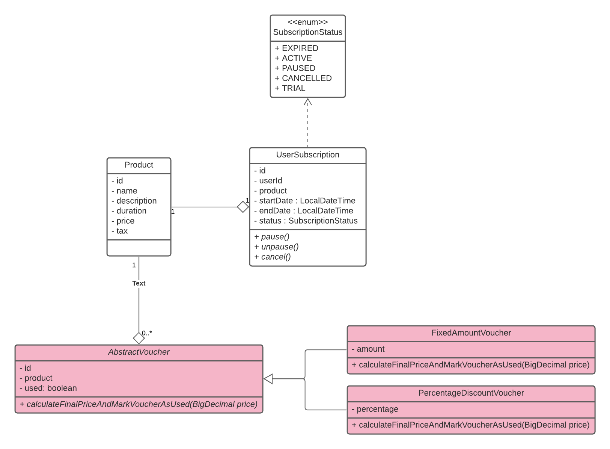

# Subscription Service

A subscription service for a product that can serve multiple supscription offers, trial subscriptions and vouchers.

## Tech Stack
* **Java 11** as programming language
* **Spring Boot 2.4.2** as framework
* **H2** as datasource
* **JPA** as ORM tool
* **Swagger** as API visualizer
* **Mockito** and JUnit for testing
* **Lucid Chart** for design illustration

## Design

Can be seen below. Red marked boxes are missing which can be done as illustrated.

## Api Docs

All has been seen on swagger: http://localhost:8080/swagger-ui/

## Jobs

there is only one job which moves TRIAL subscriptions to ACTIVE if they are not cancelled yet.
The job class: [TrialToActiveSchedulerService](/src/main/java/com/supercompany/subscriptionservice/service/TrialToActiveSchedulerService.java)